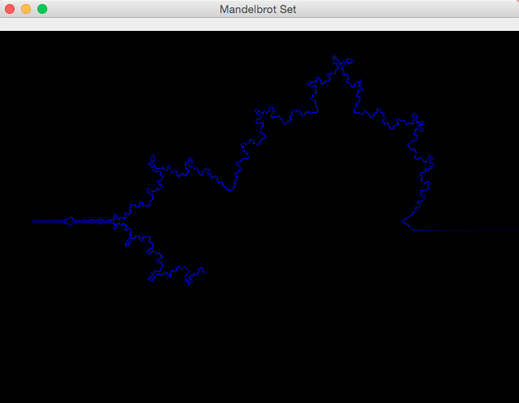

Mandelbrot Set
==============

**Computing the Edge of the Mandelbrot Set with a Turing Machine**


Abstract
--------

The Mandelbrot set is the set of values of c in the complex plane for which the orbit of 0 
under iteration of the complex quadratic polynomial z_(n+1)=z_n^2+c remains bounded.

That is, a complex number c is part of the Mandelbrot set if, when starting with z0 = 0 
and applying the iteration repeatedly, the absolute value of zn remains bounded 
however large n gets. 

More
----
* https://de.wikipedia.org/wiki/Mandelbrot-Menge
* https://en.wikipedia.org/wiki/Mandelbrot_set

Blog Post
---------
* http://thomas-woehlke.blogspot.de/2016/01/mandelbrot-set-drawn-by-turing-machine.html


Screenshot
----------




Git Repository
--------------
* [https://bitbucket.org/ThomasWoehlke/mandelbrot](https://github.com/thomaswoehlke/mandelbrot.git)


Maven Wrapper
-------------
* [https://github.com/takari/maven-wrapper](https://github.com/takari/maven-wrapper) 
* [https://www.baeldung.com/maven-wrapper](https://www.baeldung.com/maven-wrapper) 

Run the Desktop Application
---------------------------

```
git clone https://github.com/thomaswoehlke/mandelbrot.git
cd mandelbrot
mvnw -Pdefault clean install exec:java
```

Run the Applet Test
-------------------
```
git clone https://github.com/thomaswoehlke/mandelbrot.git
cd mandelbrot
mvnw -Pdefault clean install exec:java
```

